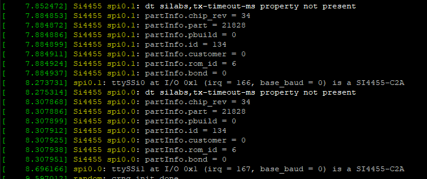
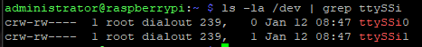
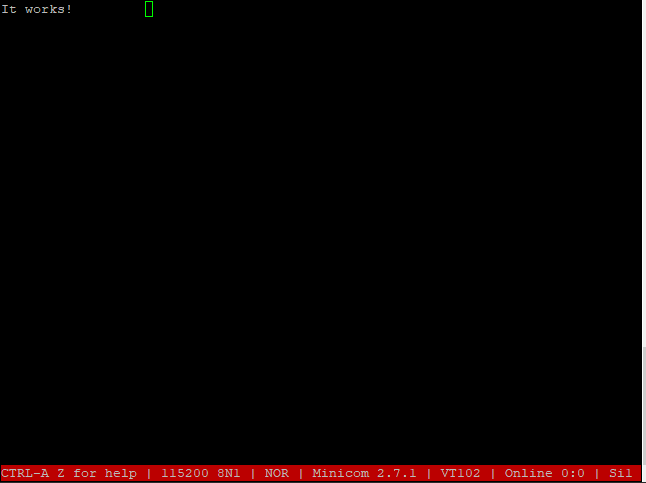

# linux-serial-si4455

This is a serial port driver for
 Silicon Labs Si4455 Sub-GHz transciver.

The goal of this driver is to removing wires
 between central(linux) device and remote serial devices/sensors,
 but keeping the original user software.
 It represents regular serial interface for the user space.

[0] - Datasheet: https://www.silabs.com/documents/public/data-sheets/Si4455.pdf

Additional readings:
* [1] - [AN 692 Si4355/Si4455 PROGRAMMING GUIDE](https://www.silabs.com/documents/public/application-notes/AN692.pdf)
* [2] - [AN796 WIRELESS DEVELOPMENT SUITE GENERAL DESCRIPTION
](https://www.silabs.com/documents/public/application-notes/AN796.pdf)
* [3] - [EZRadio REVB1A API](https://www.silabs.com/documents/public/application-notes/EZRadio_REVB1_API.zip)
* [4] - [EZRadio REVC2A API](https://www.silabs.com/documents/public/application-notes/EZRadio_REVC2_API.zip)
* [5] - [Using PART_INFO command to identify EZRadio/PRO part number](https://www.silabs.com/community/wireless/proprietary/knowledge-base.entry.html/2017/04/04/using_part_info_comm-XwP9)

**Table of contents**
  * [1. Building](#1-building)
    + [1.1. Prerequirements](#11-prerequirements)
    + [1.2. Compile](#12-compile)
  * [2. Interfaces](#2-interfaces)
    + [2.1. Device tree bindings](#21-device-tree-bindings)
    + [2.2. Device configuration(firmware)](#22-device-configuration-firmware-)
      - [2.2.1. Prerequirements](#221-prerequirements)
      - [2.2.2. Generate](#222-generate)
      - [2.2.3. Compile](#223-compile)
    + [2.3. device](#23-device)
    + [2.4. sysfs](#24-sysfs)
    + [2.5. debugfs](#25-debugfs)
  * [3. Sample setup with Raspberry Pi 3](#3-sample-setup-with-raspberry-pi-3)
    + [3.1. Building](#31-building)
      - [3.1.1 Prerequirements](#311-prerequirements)
      - [3.1.1 Compile](#311-compile)
  * [4. Testing](#4-testing)
    + [4.1. Compiling](#41-compiling)
    + [4.2. Testing](#42-testing)

## 1. Building

### 1.1. Prerequirements

>sudo apt install git bc bison flex libssl-dev libncurses5-dev

### 1.2. Compile

>git clone https://github.com/dministro/linux-serial-si4455 
cd linux-serial-si4455/src/linux/drivers/tty/serial 
make -C `/path/to/kernel/source` M=$(pwd) modules

## 2. Interfaces

### 2.1. Device tree bindings

You can see the required parameters in [silabs,si4455.yaml](src/linux/Documentation/devicetree/bindings/serial/silabs,si4455.yaml)

### 2.2. Device configuration(firmware)

#### 2.2.1. Prerequirements

To generate radio configuration, the Silicon Labs [Wireless Development Suite](https://www.silabs.com/documents/login/software/WDS3-Setup.exe) is required.

#### 2.2.2. Generate

Before you start, see ref: [2]

1. Start WDS
2. Select *Simulate radio* option on startup screen
3. Select *Si4455* and revision you have in *Select Radio* dialog
>It is important to select the proper revision, because the generated configuration is different between revision B1 and C2.
4. Select *Radio Configuration Application* in *Application Manager*
5. Select *Bidirectional packet* project in *Radio Configuration Application* dialog.
6. Make your project specific configuration. 
   *You can find some configuration file under wds_examples directory*
7. Click *Generate source* than choose *Save custom radio configuration header file*

#### 2.2.3. Compile

>cd fw 
make FW_NAME=test.bin \\ 
RADIO_CONFIG=../wds_examples/radio_config_si4455_revb1_ook_bidirectional_packet_15.h \\ 
firmware

The resulting configuration file path: build/test.bin

Parameters:
* **RADIO_CONFIG**: path to radio configuration header generated by WDS
* **FW_NAME**: the resulting file name
* **FW_PREFIX**: firmware installation path in case of firmware-install rule. 
default: /lib/firmware

Rules:
* *firmware*: compiles the firmware binary file
* *firmware-install*: *firmware* rule plus installs the firmware binary under the given **FW_PREFIX**

### 2.3. device

The driver instances are comes up under `/dev` as
>/dev/ttySL`X`

, where `X` is the index of instance.

The driver supports only:
* Char size: 8 bits
* Handshake: None or RTSCTS.  
RTSCTS preferred

### 2.4. sysfs
The si4455 driver uses configuration parameters and maintains statistics inside sysfs filesystem.

**current_rssi**

Path:
>/sys/class/tty/ttySL`X`/device/current_rssi

Description:
>Shows the latest rssi value measured by chip. 
To convert the value to dBm. See chapter *3.2.1. Received Signal Strength Indicator* in [0]

**package_size**

Path:
>/sys/class/tty/ttySL`X`/device/package_size

Description:
>Shows or stores the package size. 
The new value applied immediately. 
Variable package size (package_size = 0)

**rx_channel**

Path:
>/sys/class/tty/ttySL`X`/device/rx_channel

Description:
>Shows or stores the receive channel index. 
The new value applied immediately.

**tx_channel**

Path:
>/sys/class/tty/ttySL`X`/device/tx_channel

Description:
>Shows or stores transmit channel index. 
The new value will be used on next data transmit.

**tx_timeout**

Path:
>/sys/class/tty/ttySL`X`/device/tx_timeout

Description:
>Shows or stores the transmit timeout. 
The new value will be used on next data transmit.

### 2.5. debugfs
The si4455 driver maintains statistics inside debugfs filesystem.

**cts_error_count**

Path:
>/sys/kernel/debug/spi`X`.`Y`/si4455/cts_error_count

Description:
>The numer of cts timeouts. In case of cts timeout, the driver reinitialize the chip.

**tx_error_count**

Path:
>/sys/kernel/debug/spi`X`.`Y`/si4455/tx_error_count

Description:
>The number of tx timeouts. In case of tx timeout, the driver restarts the last data transmission.

**chip_rev**
Path:
>/sys/kernel/debug/spi`X`.`Y`/si4455/partinfo/chip_rev

Description:
>The value of CHIPREV field in PART_INFO structure. 
See *PART_INFO* command details in [3] or in [4] 

**rom_id**
Path:
>/sys/kernel/debug/spi`X`.`Y`/si4455/partinfo/rom_id

Description:
>The value of ROMID field in PART_INFO structure. 
See *PART_INFO* command details in [3] or in [4] 
See ref [5]

**part**
Path:
>/sys/kernel/debug/spi`X`.`Y`/si4455/partinfo/part

Description:
>The value of PART field in PART_INFO structure. 
See *PART_INFO* command details in [3] or in [4] 
See ref [5]

## 3. Sample setup with Raspberry Pi 3

Wiring:
|Raspberry Pi|Function           |Color |ZETA-433|
|------------|-------------------|------|--------|
|17          |3V3                |red   |4       |
|19          |SPI0 MOSI          |yellow|10      |
|21          |SPI0 MISO          |orange|11      |
|23          |SPI0 SCLK          |green |9       |
|25          |GND                |black |2       |
|26          |SPI0 CE1           |grey  |12      |
|38          |GPIO 20 *interrupt*|brown |5       |
|40          |GPIO 21 *shutdown* |white |3       |

### 3.1. Building

#### 3.1.1 Prerequirements

To compile si4455 kernel module on a Raspbian target the proper version of kernel source is required. 
See: https://github.com/RPi-Distro/rpi-source

>sudo apt install git bc bison flex libssl-dev libncurses5-dev

#### 3.1.1 Compile

For the setup above:

>cd rpi_setup 
make \\ 
OL_BUS=0 \\ 
OL_DEV=1 \\ 
OL_SDN=21 \\ 
OL_IRQ=20 \\ 
OL_PACKAGE_SIZE=0 \\ 
RADIO_CONFIG=../wds_examples/radio_config_si4455_revc2_ook_bidirectional_packet_variable.h \\ 
all

Parameters:
* **OL_BUS**: spi bus index 
  default: 0
* **OL_DEV**: spi device index 
  default: 1
* **OL_SDN**: shutdown gpio index 
  default: 21
* **OL_IRQ**: interrupt gpio index 
  default: 20
* **OL_PACKAGE_SIZE**: package size configured in WDS. 0 means variable package size. 
  default: 15
* **OL_TX_CHANNEL**: transmit channel 
  default: 3
* **OL_RX_CHANNEL**: receive channel 
  default: 3
* **OL_TX_TIMEOUT**: transmit timeout(ms) 
  default: 100
* **RADIO_CONFIG**: path to radio configuration header generated by WDS
* **OL_FW_NAME**: generated firmware file name. 
  default: si4455_spi\$(OL_BUS)_\$(OL_DEV).ez.bin

Rules:
* *driver*: compiles the kernel module(si4455.ko)
* *driver-install*: *driver* rule plus copies the `si4455.ko` under `/lib/modules/$(uname -r)/extra`, then invokes depmod. 
  Requires: **root privilages**
* *firmware*: compiles the firmware binary file
* *firmware-install*: *firmware* rule plus installs the firmware binary under `/lib/firmware`. 
  Requires: **root privilages**
* *overlay*: generates and compiles device tree bindings overlay. 
  Generated overlay name(under `output/overlay/build`): si4455_spi\$(OL_BUS)_\$(OL_DEV).dtbo
* *overlay-install*: *overlay* rule plus installs the overlay under `/boot/overlays`. 
  Requires: **root privilages**
* *boot-configure*: enables the spi port and adds the overlay in `/boot/config.txt`. 
  Requires: **root privilages**
* *install*: *driver-install*, *firmware-install* and *overlay-install* rules. 
  Requires: **root privilages**
* *all*: *install* and *boot-configure* rules. 
  Requires: **root privilages**

## 4. Testing

BOM:

* 1 × breadboard
* 1 × [Raspberry Pi 3 Model B](https://www.raspberrypi.org/products/raspberry-pi-3-model-b/)
* 2 × [FM ZETA DIP TRANSCEIVER MODULE](https://www.rfsolutions.co.uk/radio-modules-c10/fm-zeta-dip-transceiver-module-433mhz-p620)
* some jumper wire to connectting parts

Wiring:
|Raspberry Pi|Function           |ZETA-433 #0|ZETA-433 #1|
|------------|-------------------|-----------|-----------|
|17          |3V3                |4          |4          |
|19          |SPI0 MOSI          |10         |10         |
|21          |SPI0 MISO          |11         |11         |
|23          |SPI0 SCLK          |9          |9          |
|25          |GND                |2          |2          |
|24          |SPI0 CE0           |12         |-          |
|16          |GPIO 23 *interrupt*|5          |-          |
|18          |GPIO 24 *shutdown* |3          |-          |
|26          |SPI0 CE1           |-          |12         |
|38          |GPIO 20 *interrupt*|-          |5          |
|40          |GPIO 21 *shutdown* |-          |3          |

### 4.1. Compiling
For ZETA-433 #0:
>cd rpi_setup 
make \\ 
OL_BUS=0 \\ 
OL_DEV=0 \\ 
OL_SDN=24 \\ 
OL_IRQ=23 \\ 
OL_PACKAGE_SIZE=0 \\ 
RADIO_CONFIG=../wds_examples/radio_config_si4455_revc2_ook_bidirectional_packet_variable.h \\ 
all

For ZETA-433 #1:
>cd rpi_setup 
make \\ 
OL_BUS=0 \\ 
OL_DEV=1 \\ 
OL_SDN=21 \\ 
OL_IRQ=20 \\ 
OL_PACKAGE_SIZE=0 \\ 
RADIO_CONFIG=../wds_examples/radio_config_si4455_revc2_ook_bidirectional_packet_variable.h \\ 
all

### 4.2. Testing
After compiling, restart is required to load overlays.

If probe success after boot, dmesg: 

The new devices are under `/dev`: 

If the new devices are visible under `/dev`, they are ready to use as a serial device. 
Testing with [minicom](https://linux.die.net/man/1/minicom) or [tio](http://tio.github.io/):

>tio -f none /dev/ttySL0 

>minicom -c on -D /dev/ttySL1 

